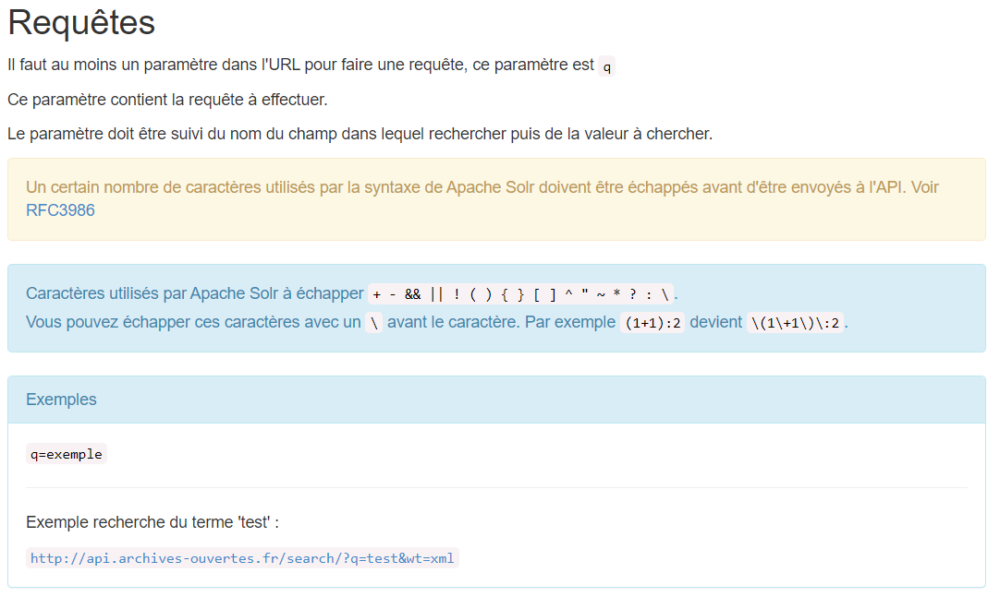
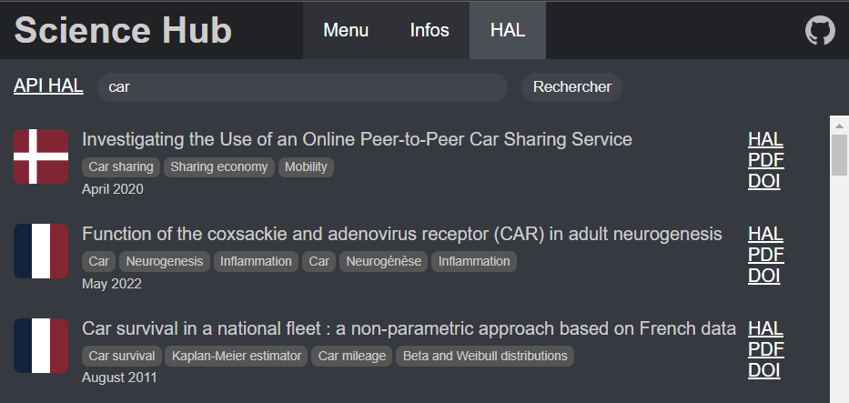

- 
	- ## What is Scientific literature ?
	  {:height 364, :width 554}
- # Context of our project
	- ## Paid data
	   
	  Consult scientific documents without paying
	- Depending on the scientific disciplines, between 60% and 80% of scientific articles are only available on paid subscriptions on publishers' websites.
	- Insufficient access to subscription articles that encourage the use of illegal means
- ## Complicated data to find (Where to look)
  
- ## How scientific publications works
  Publicly funded
  Peer review managed by editors (ex: Elsevier)
  Lack of funding
	- {:height 236, :width 467}
	  Permanent identification mechanism for digital resources.
	  Used for research reports and official publications
	- H-Index
	  
	  Measures the productivity and citation impact of a scientist
- ## Scientific publishing site
	- 
	  Scholarly literature
	- 
	  Patents
	- {:height 215, :width 470}
	  Open archive for scholarly documents
	  Offers an open API for querying documents
	- 
	- {:height 255, :width 419}
	  Illegal website provinding free access to millions of research papers.
	  Alexandra Elbakyan
	- 
	- 
- ## Our solution
  **Science Hub** web-app
  Web app to easily access to scientific articles
    Uses data from HAL
  - ### How to use it?
    1) Type key-words
    2) Displays related articles
    3) Browse article on HAL, download PDF, get
- ## API or Scraping?
  - ### Difference
    **API** => Easy way to request specific data
    **Scraping** => Complex search in HTML code for specific data
  - ### Uses
    **Google Scholar**: closed to scraping
    **HAL**: offers a free API

- ## Process of querying
  - ### Learn about HAL API
    [HAL API](https://api.archives-ouvertes.fr/docs/search)
    
  - ### 1 - Build url
    Retrieve parameters
    ```ts
    apiMaker: {
      q: 'car', // Query (key-words for title, authors, country, etc.)
      wt: 'json', // Format of response
      rows: '100', // Number of results
      fl: fl.join(',') // Elements I want to fetch
    }
    ```
  - ### 1 - Build url
    Builds the URL to query the HAL API
    ```ts
    buildUrl(): string {
      return (
        entryPoints.root +
        '?' +
        Object.entries(this.state.apiMaker)
          .map((
            [key, value]) => {
            return key + '=' + value
          }).
          join('&'));
      // Output : http://api.archives-ouvertes.fr/search?q=car&wt=json&rows=100&fl=[...]
    }
    ```
  - ### 2 - Request the source
    HTTP GET request with `fetch` method
    ```ts
    export function httpService(url: string, func: Function): void {
      console.warn(url);
      fetch(url, { method: 'GET', mode: 'cors' }).then(res => {
          res.json().then(data => {
              func(data);
          });
      })
    }
    ```
  - ### 3 - Process response
    `HTML` and `SCSS` display using `React`
    